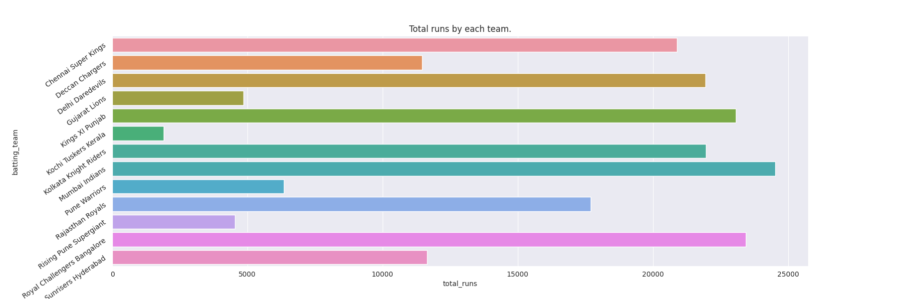
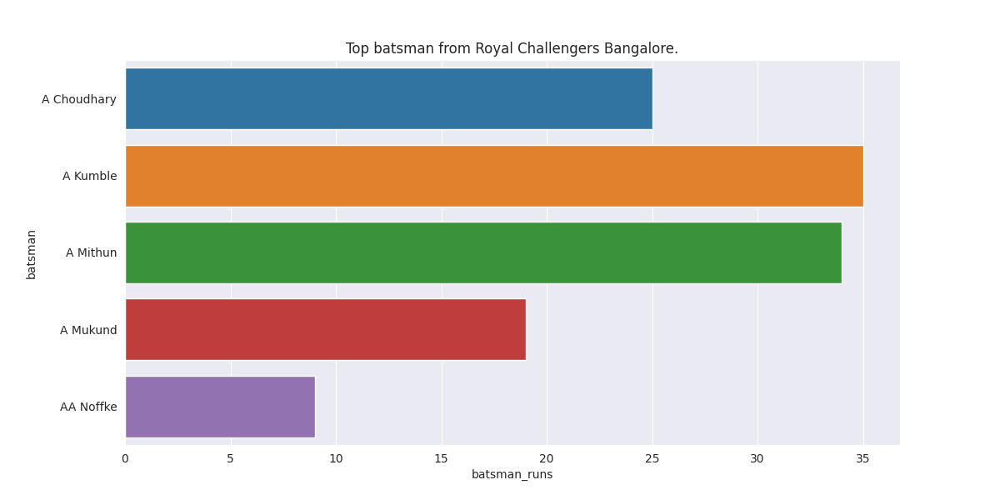
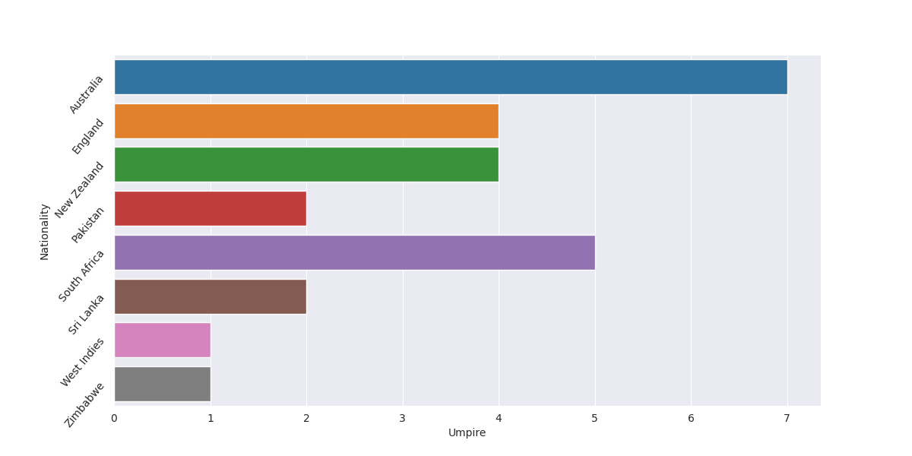
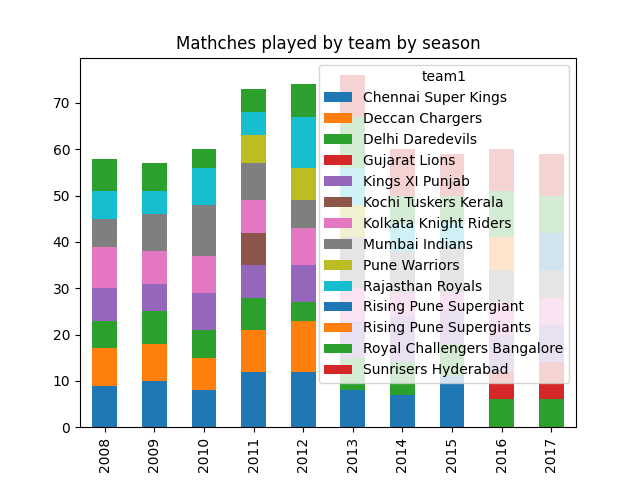

# Python-data-project

Project for IPL data munging in python

## Usage
* Solution of each problem is present in the separate files.\
Denoted as -> problem_1.py

* All programs execute in the similar manner.
* The result of each program is present inside the **output** directory.

# Problems
#### 1. Total runs scored by team
>Plot a chart of the total runs scored by each teams over the history of IPL. Hint: use the total_runs field.

  

#### 2. Top batsman for Royal Challengers Bangalore
>Consider only games played by Royal Challengers Bangalore. Now plot the total runs scored by every batsman playing for Royal Challengers Bangalore over the history of IPL.

  

#### 3. Foreign umpire analysis
>Obtain a source for country of origin of umpires. Plot a chart of number of umpires by in IPL by country. Indian umpires should be ignored as this would dominate the graph.

  

#### 4. Stacked/Grouped chart of matches played by team by season
>Plot a stacked/grouped bar chart of ...
number of games played
>* by team
>* by season  

